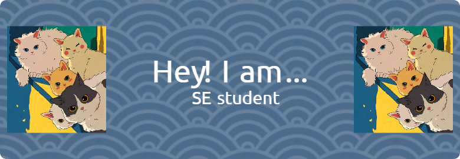

## Hi there 👋

I'm Noor Aisyah, a Software Engineering student at Univeristy of Malaya.

- 🌱 I’m currently learning and expanding my knowledge on software development and computer science in general. Doing so by watching youtube videos, researching materials, and taking online courses related to software development. And of course by attending lectures and tutorials in UM.

- ⚡ Fun fact: I like to crochet and knit in my free time. And I also have 10 cats at home!

<!--
**aisyah551/aisyah551** is a ✨ _special_ ✨ repository because its `README.md` (this file) appears on your GitHub profile.

Here are some ideas to get you started:

- 🔭 I’m currently working on ...
- 🌱 I’m currently learning ...
- 👯 I’m looking to collaborate on ...
- 🤔 I’m looking for help with ...
- 💬 Ask me about ...
- 📫 How to reach me: ...
- 😄 Pronouns: ...
- ⚡ Fun fact: ...
-->
